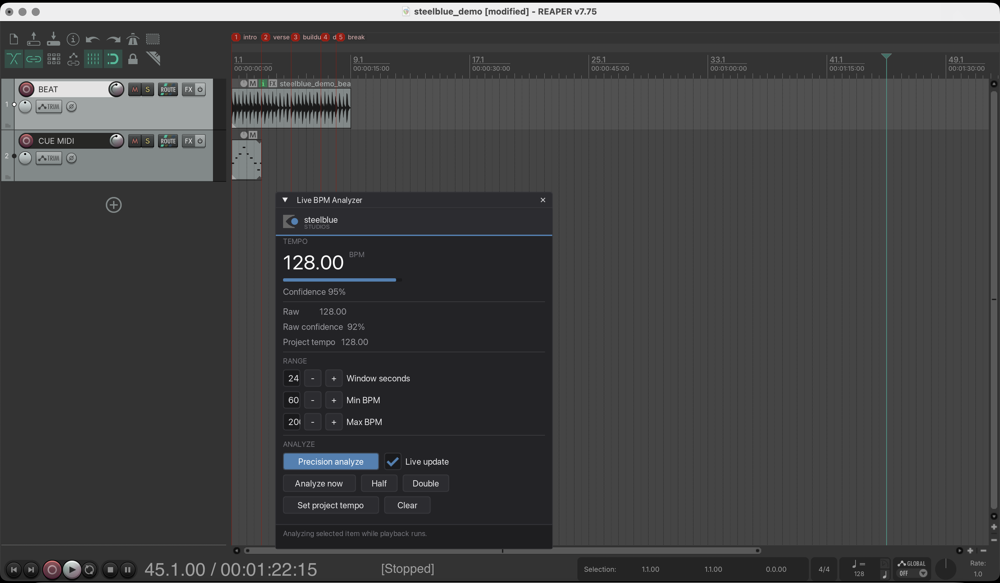
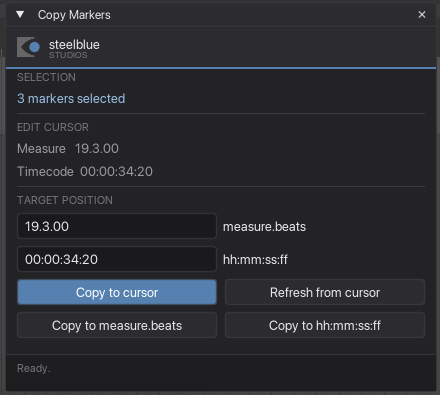

<div align="center">
  
  <h1>REAPER LD Plugin Set</h1>
  <p><em>Four tools for cue programming in REAPER — for lighting designers who write their timecode cues as markers.</em></p>
  <p><strong>steelblue studios</strong></p>
</div>

---

If you build light shows to a timeline, you probably live in REAPER's markers: one marker per cue, named for your console. These four plugins take the tedious parts of that off your hands — finding the real tempo, turning a MIDI rhythm into cues, naming a whole block at once, and copying a block to where the music repeats.

Tested on **macOS and Windows**, REAPER 7.

## The plugins

| Plugin | What it does |
| --- | --- |
| **Live BPM Analyzer** | Reads the real tempo out of the audio to two decimals and sets the project tempo — without moving anything you have already placed. |
| **MIDI notes to project markers** | Turns a MIDI item into markers: one per note, named after the note and coloured by pitch. Write your cue rhythm as MIDI, get cues. |
| **Rename selected markers** | Builds MA-Tools cue names for a whole selection at once, with a live preview and cue numbering that wraps. |
| **Copy Markers** | Duplicates a block of markers somewhere else, keeping their spacing, names and colours. For the chorus that comes back later in the song. |

<div align="center">
  
  &nbsp;
  
</div>

## Install

**Download the package for your system from the [latest release](../../releases/latest):**

- macOS → `steelblue-LD-Plugin-Set-macOS.dmg`
- Windows → `steelblue-LD-Plugin-Set-Windows.zip`

Then, in REAPER — one step:

```
Actions  ▸  Show Action List  ▸  New action…  ▸  Load ReaScript…
```

Pick **`steelblue_install.lua`** from the package and run it. The installer copies the plugins into REAPER's own Scripts folder, registers all four as actions, offers you a keyboard shortcut for each, and — because REAPER only loads extensions at startup — offers to quit REAPER so the next launch has everything ready.

That is the whole install. Afterwards you can throw the package away.

> **Why a script and not an .exe / .pkg?** Only a script running *inside* REAPER can register an action or open the shortcut dialog (`AddRemoveReaScript` exists only in-process). An external installer could drop files in place but would still leave you to "Load ReaScript…" by hand — so the script does the job an installer can't.

### The two extensions — included, not downloaded

The plugins need two REAPER extensions, and **both are bundled** for every supported architecture:

- **ReaImGui** — draws all four plugin windows.
- **js_ReaScriptAPI** — lets *Rename selected markers* read the order of your selection in the Region/Marker Manager.

Neither ships with REAPER. The installer picks the right build for your machine and installs it only if it is missing — it **never overwrites or downgrades** an extension you already have, and if you manage extensions through [ReaPack](https://reapack.com), ReaPack stays in charge. Both are the authors' own unmodified builds under their own licenses; see [`extensions/NOTICE.txt`](extensions/NOTICE.txt).

### The one thing everybody trips over

Before starting a marker plugin from a shortcut, **click once into the arrange view.** While the Region/Marker Manager has keyboard focus it swallows the shortcut — the window never appears, and your marker selection gets cleared as well.

## Try it without a real show

The [`Demo Project/`](Demo%20Project) folder holds a small REAPER project — a beat at exactly 128 BPM, a MIDI item, and named markers — so you can follow every guide without touching a real show file.

## Guides

One page per plugin, with screenshots, under [`Tutorials/`](Tutorials) (open `index.html`), and the same guides as PDF in the package. There is also a short phone-format walkthrough of Copy Markers at [`Tutorials/video/`](Tutorials/video).

## Building from source

```sh
./build-package.sh all      # both packages into dist/
./build-package.sh mac      # just the .dmg
./build-package.sh win      # just the .zip
```

The tests run in plain Lua, no REAPER required — they build fake `reaper` tables from the real API name lists:

```sh
for t in tests/*_test.lua; do lua "$t"; done
```

## License

steelblue studios code is [MIT](LICENSE). The two bundled extensions keep their own licenses (ReaImGui: LGPL-3.0, js_ReaScriptAPI: MIT) — see [`extensions/NOTICE.txt`](extensions/NOTICE.txt).
