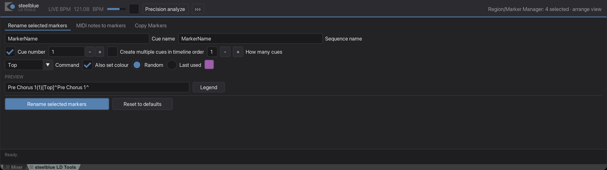
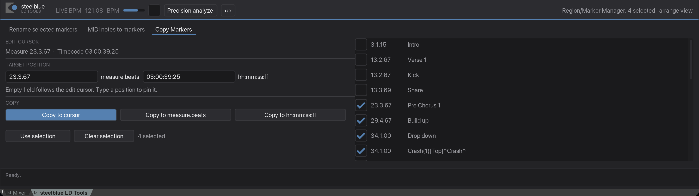

<div align="center">
  
  <h1>REAPER LD Plugin Set</h1>
  <p><em>Tools for cue programming in REAPER — for lighting designers who write their timecode cues as markers.</em></p>
  <p><strong>steelblue studios</strong></p>
</div>

---

If you build light shows to a timeline, you probably live in REAPER's markers: one marker per cue, named for your console. These plugins take the tedious parts of that off your hands — finding the real tempo, turning a MIDI rhythm into cues, naming a whole block at once, and copying a block to where the music repeats.

Since 2.0 there is a fifth thing in the package: **steelblue LD Tools**, one window that sits in REAPER's bottom docker next to the Mixer and holds all of it — the live tempo read-out in its header band, and Rename, MIDI and Copy as tabs. It opens with REAPER and stays there, so none of this needs starting any more. The four single plugins are still in the package and still work exactly as before.

2.0.0 was tested on macOS. Windows was tested for 1.0.0 and everything since is platform-neutral Lua — except the docker slot the workspace asks REAPER for, which has only ever been verified on macOS. REAPER 7.

## The plugins

| Plugin | What it does |
| --- | --- |
| **steelblue LD Tools** | All of the below in one docked window: the tempo read-out in the header, and Rename · MIDI notes to markers · Copy Markers as tabs. Opens with REAPER. |
| **Live BPM Analyzer** | Reads the real tempo out of the audio to two decimals and sets the project tempo — without moving anything you have already placed. |
| **MIDI notes to project markers** | Turns a MIDI item into markers: one per note, in a ruler lane per track, named and coloured to match the track. Write your cue rhythm as MIDI, get cues. |
| **Rename selected markers** | Builds MA-Tools cue names for a whole selection at once, with a live preview and cue numbering that wraps. |
| **Copy Markers** | Duplicates a block of markers somewhere else, keeping their spacing, names and colours. For the chorus that comes back later in the song. |

<div align="center">
  
  &nbsp;
  
</div>

## What's new in 2.0.0

- **steelblue LD Tools** — a new window that lives in REAPER's bottom docker next to the Mixer. Header band: the live BPM read-out with its confidence bar, a switch, **Precision analyze**, and a `›››` button for the rest of the analyzer. Below it: the tabs **Rename selected markers · MIDI notes to markers · Copy Markers**, and one status line at the bottom that belongs to whichever tab is open.
- **Starts with REAPER.** The installer writes a small marked block into REAPER's `Scripts/__startup.eel`, so the window is there every time you open REAPER. Delete that block to stop it.
- **The installer registers five actions now** — the four plugins and the workspace — copies everything into REAPER's Scripts folder, and removes `.lua` files there that are no longer part of the set, naming each one it removed.
- **Rename selected markers** — a **Legend** button next to the preview explains every part of the syntax (in the docked tab it takes over the tab body; in the single window it is a popup). The Command list defaults to **Top**.
- **MIDI notes to project markers** — a **Ruler lanes** section: one lane per track, named after the track, plus **Replace existing markers in these lanes**. Below REAPER 7.72 it says so and writes names and colours without lanes.
- **Copy Markers** — a list of every marker in the project with a tick box next to each. It mirrors the Region/Marker Manager's selection until you tick something yourself; **Use selection** goes back to following it, **Clear selection** empties it, and what is ticked is what gets copied. Copies keep their ruler lane.
- **Live BPM Analyzer** — a **Source** line naming the track, take and file being analysed, and it steps around timecode tracks (LTC/SMPTE/MTC/TC by name) when it picks the item. **Precision analyze** now runs in the background with a progress bar instead of freezing the window.

## What's new in 1.1.3

- **Live BPM Analyzer** — skips timecode tracks (LTC/SMPTE/MTC by name) and prefers the selected item, then the selected track.
- **Live BPM Analyzer** — the window now shows which item is analysed.

## What's new in 1.1.2

- **Rename selected markers** — `-`/`+` buttons next to the cue number field step it down or up by one.

## What's new in 1.1.1

- **Rename selected markers** — "Also set colour" is on by default (a random colour per run; untick it to leave the marker colours alone).
- **Rename selected markers** — the Command field is a list: Go, Top, Flash (default Top). A selected marker that already carries another command keeps it, shown as a fourth entry until you pick one of the three.
- **MIDI notes to project markers** — the same Command list, default Top (was a free-text field with `GO`).

## What's new in 1.1.0

- **Rename selected markers** — three free-text fields (cue name, command, sequence name; leave one empty to skip it), a "Reset to defaults" button, and an optional colour (random or last used). Recognises existing MA-Tools syntax instead of wrapping it a second time, and keeps the marker's ruler lane.
- **MIDI notes to project markers** — one ruler lane per track (named after the track, without the `(12)`-style suffix), cue number by pitch rank, markers and lane coloured to match the track, a command field (default `GO`), an option to replace existing markers in these lanes, and a warning when two tracks share a name.
- **Copy Markers** — copies keep their ruler lane, and the target fields now follow the edit cursor.
- **Live BPM Analyzer** — live analysis no longer stalls playback (108 ms → 3 ms per update); after a seek or start, the window rebuilds from the cursor (up to 4 s for the first reading); the footer shows the analysis time.
- All four plugins now tell you on startup if ReaImGui or js_ReaScriptAPI is missing.

## Install

**Download the package for your system from the [latest release](../../releases/latest):**

- macOS → `steelblue-LD-Plugin-Set-macOS.dmg`
- Windows → `steelblue-LD-Plugin-Set-Windows.zip`

Needs REAPER 7.x. **Ruler lanes need REAPER 7.72 or newer** — below that, *MIDI notes to project markers* says so and writes marker names and colours without lanes, and everything else works unchanged.

Then, in REAPER — one step:

```
Actions  ▸  Show Action List  ▸  New action…  ▸  Load ReaScript…
```

Pick **`steelblue_install.lua`** from the package and run it. The installer copies the plugins into REAPER's own Scripts folder, registers **five actions** — the four plugins and `steelblue_workspace.lua`, which is the LD Tools window — offers you a keyboard shortcut for each, and — because REAPER only loads extensions at startup — offers to quit REAPER so the next launch has everything ready.

It also sets up the workspace to open on its own: a marked block goes into `Scripts/__startup.eel`, the file REAPER runs at every start. The summary at the end says so.

That is the whole install. Afterwards you can throw the package away.

### If you would rather not have the window open itself

Open `__startup.eel` in REAPER's own Scripts folder and delete the block between the two `// steelblue LD Tools: autostart` comment lines. Nothing else reads it, and the action stays in the Action List — you can still open the window by hand whenever you want it.

The action is called **`steelblue_workspace.lua`** in the Action List, and it is a toggle: running it while the window is open closes it again.

> **Why a script and not an .exe / .pkg?** Only a script running *inside* REAPER can register an action or open the shortcut dialog (`AddRemoveReaScript` exists only in-process). An external installer could drop files in place but would still leave you to "Load ReaScript…" by hand — so the script does the job an installer can't.

### The two extensions — included, not downloaded

The plugins need two REAPER extensions, and **both are bundled** for every supported architecture:

- **ReaImGui** — draws every window in the set, the LD Tools workspace included.
- **js_ReaScriptAPI** — lets *Rename selected markers* read the order of your selection in the Region/Marker Manager.

Neither ships with REAPER. The installer picks the right build for your machine and installs it only if it is missing — it **never overwrites or downgrades** an extension you already have, and if you manage extensions through [ReaPack](https://reapack.com), ReaPack stays in charge. Both are the authors' own unmodified builds under their own licenses; see [`extensions/NOTICE.txt`](extensions/NOTICE.txt).

### The one thing everybody trips over

Before starting a marker plugin from a shortcut, **click once into the arrange view.** While the Region/Marker Manager has keyboard focus it swallows the shortcut — the window never appears, and your marker selection gets cleared as well.

This is one reason the workspace is worth having: it is already open, so there is no shortcut to swallow. Select in the manager, look at the tab, work.

## Try it without a real show

The [`Demo Project/`](Demo%20Project) folder holds a small REAPER project — a beat at exactly 128 BPM, a MIDI item, and named markers — so you can follow every guide without touching a real show file.

## Guides

One page per plugin plus one for the workspace, with screenshots, under [`Tutorials/`](Tutorials) (open `index.html`), and the same guides as PDF in the package. There is also a short phone-format walkthrough of Copy Markers at [`Tutorials/video/`](Tutorials/video).

The written guides describe 2.0. The video still shows version 1.0 — the steps it walks through are the same, but the Copy Markers window in it has no marker list yet.

## Building from source

```sh
./build-package.sh all      # both packages into dist/
./build-package.sh mac      # just the .dmg
./build-package.sh win      # just the .zip
```

The tests run in plain Lua, no REAPER required — they build fake `reaper` tables from the real API name lists:

```sh
for t in tests/*_test.lua; do lua "$t"; done
```

## License

steelblue studios code is [MIT](LICENSE). The two bundled extensions keep their own licenses (ReaImGui: LGPL-3.0, js_ReaScriptAPI: MIT) — see [`extensions/NOTICE.txt`](extensions/NOTICE.txt).
